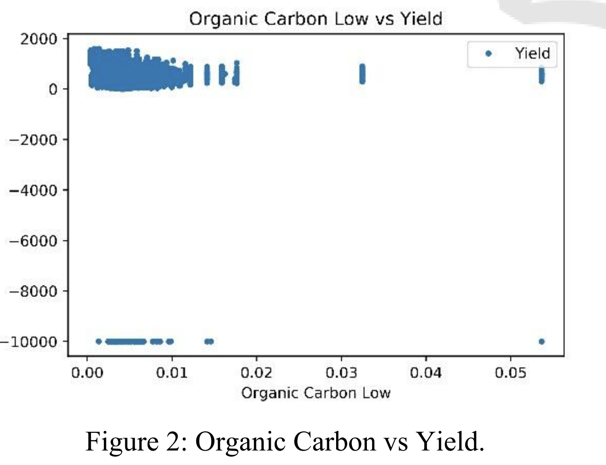

  <h1>Prediction of Cotton Field on Integrated Environmental Data</h1>
  

    <strong>ICAART 2021</strong> • Published in January 2021
  

  
  
  ## Abstract
  
  

    <a href="http://dx.doi.org/10.5220/0010240707810786" target="_blank" class="btn-enhanced btn-primary">
        📥 Download Paper
    </a>

