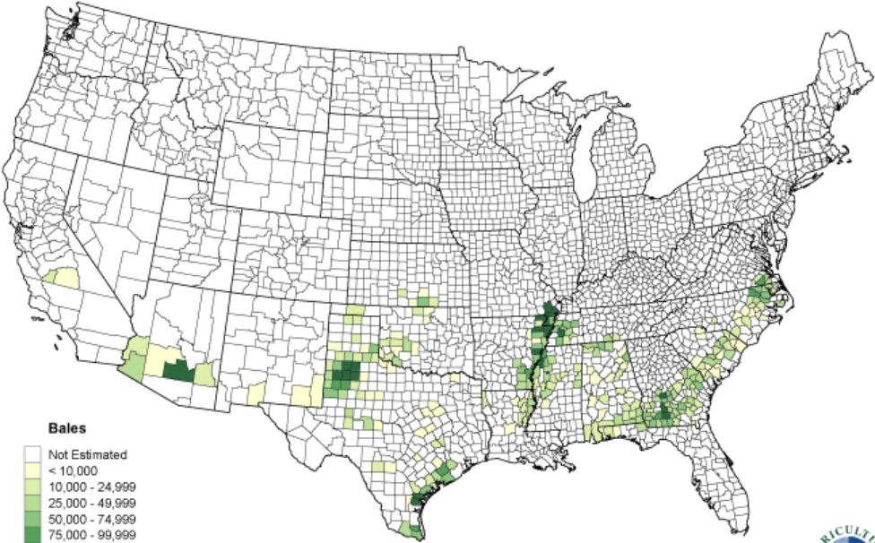

The agriculture and farming industry plays a vital role in the economy. However, the importance of agriculture cannot be fully quantified in terms of its economic profit. Agriculture affecting global hunger is a much more sensitive and vital topic. One of the leading reasons for this is un-improvised crop production. Crop production is affected by various factors, and monitoring those factors is the key to solving the problem. This paper describes a comprehensive experiment predicting the cotton yield under various environments, such as Acres Harvested, Acres Planted, Soil pH, Bulk Density, Clay-High, Clay-Low, Organic-Carbon, and Water-Area.

    <a href="http://dx.doi.org/10.5220/0010240707810786" target="_blank" 
       style="display: inline-block; padding: 12px 20px; font-size: 16px; font-weight: bold; 
              color: #fff; background-color: #0073e6; text-decoration: none; 
              border-radius: 8px; box-shadow: 2px 2px 8px rgba(0, 0, 0, 0.2);">
        📥 Download Paper
    </a>

