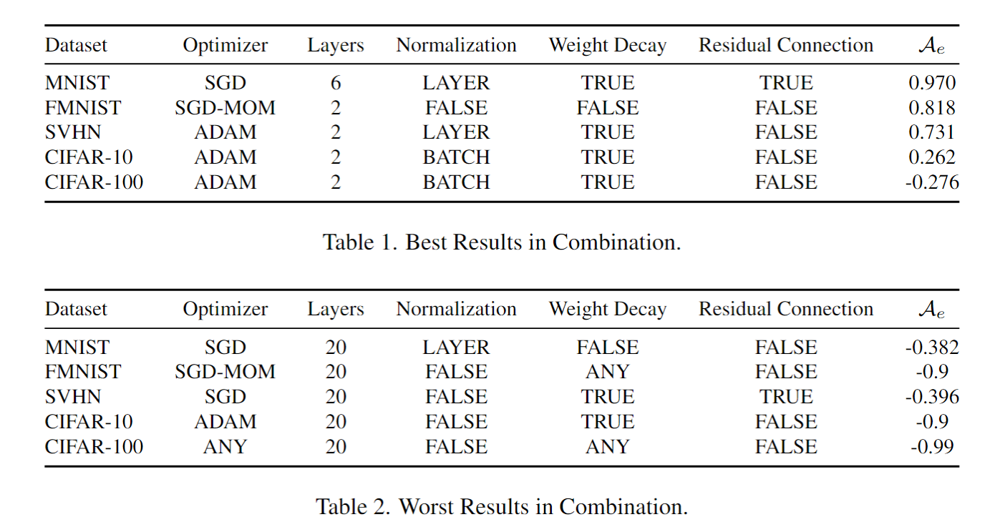

---
A known problem with training deep neural networks,mostly parameterized by connection weights at each layer, is that of finding an appropriate model complexity under the empirical risk minimization setting. Ideally, the goal is for
the model to produce a satisfactory indication of high accuracy while retaining the attractive property of performance
reproducibility (generalization), at least, on a test-set assumed to be drawn from the same distribution as the trainset. In an attempt to address such problems, a lot of regularization methods have been proposed. In this work, we empirically study regularization and reproducibility from the
perspective of test-set prediction consistency across several
training runs. We then introduce effective test accuracy as
a trust-measure on the predictions made during training,
which can supplement conventional test accuracy as a metric for reporting performance. Specifically, we use the metric to quantify the effect that common categories of regularizers used in training deep feed-forward neural networks
have on consistent (reproducible) predictions. Our findings
across multiple benchmark image recognition datasets indicate that the structure of a feed-forward neural network is a
higher weighted factor than other explicitly added regularization methods for improving reproducibility