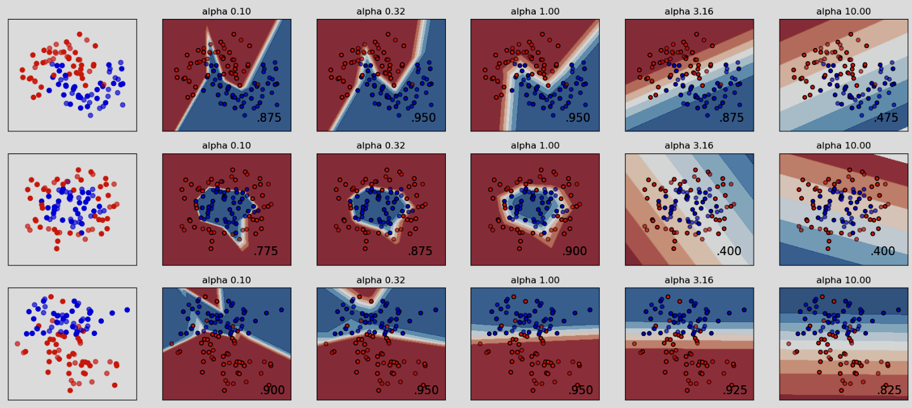

---
A known problem with training deep neural networks,
mostly parameterized by connection weights at each layer,
is that of finding an appropriate model complexity under the
empirical risk minimization setting. Ideally, the goal is for
the model to produce a satisfactory indication of high accu-
racy while retaining the attractive property of performance
reproducibility (generalization), at least, on a test-set as-
sumed to be drawn from the same distribution as the train-
set. In an attempt to address such problems, a lot of regular-
ization methods have been proposed. In this work, we em-
pirically study regularization and reproducibility from the
perspective of test-set prediction consistency across several
training runs. We then introduce effective test accuracy as
a trust-measure on the predictions made during training,
which can supplement conventional test accuracy as a met-
ric for reporting performance. Specifically, we use the met-
ric to quantify the effect that common categories of regu-
larizers used in training deep feed-forward neural networks
have on consistent (reproducible) predictions. Our findings
across multiple benchmark image recognition datasets indi-
cate that the structure of a feed-forward neural network is a
higher weighted factor than other explicitly added regular-
ization methods for improving reproducibility