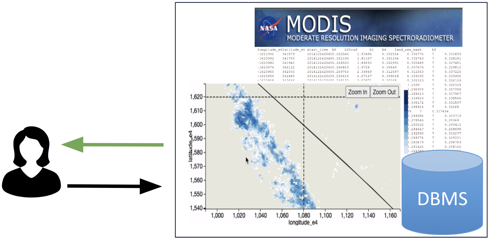

  <h1>How Does User Behavior Evolve During Exploratory Visual Analysis?</h1>
  

    <strong>AAAI 2024</strong> • Published in January 2024
  

  
  
  ## Abstract
  
  

    <a href="https://arxiv.org/pdf/2312.09407.pdf" target="_blank" class="btn-enhanced btn-primary">
        📥 Download Paper
    </a>

