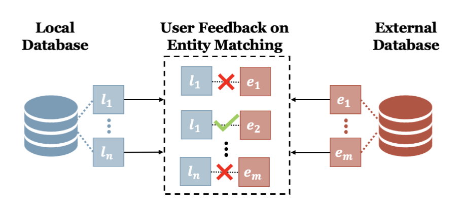

<div class="project-header">
  <h1>Find your Match: Towards Simulating User Relevance Feedback</h1>
  <div class="project-meta">
    <strong>Conference 2022</strong> • Published in March 2022
  </div>
</div>

<div class="project-card">
  
  
  ## Abstract
  
  


```
</div>

<div style="text-align: center; margin: 2em 0;">
    <a href="http://nischal5123.github.io/files/Paper_Find_your_Match__Towards_Simulating_User_Relevance_Feedback.pdf" target="_blank" class="btn-enhanced btn-primary">
        📥 Download Paper
    </a>
</div>
