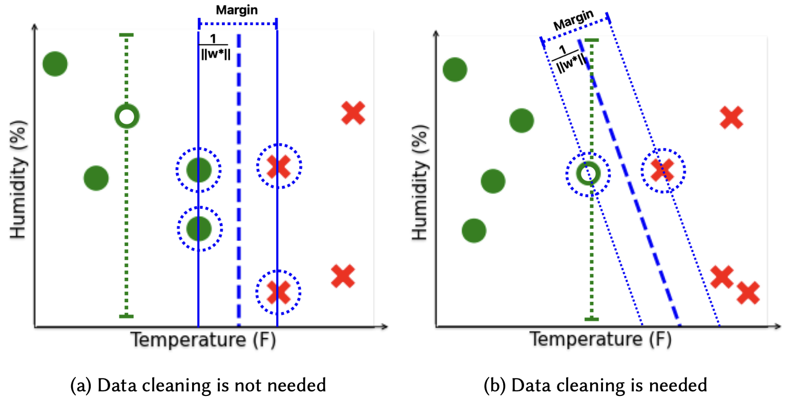

<div class="project-header">
  <h1>Certain and Approximately Certain Models for Statistical Learning</h1>
  <div class="project-meta">
    <strong>SIGMOD 2024</strong> • Published in April 2024
  </div>
</div>

<div class="project-card">
  
  
  ## Abstract
  
  Real-world data is often incomplete and contains missing values.
  To train accurate models over real-world datasets, users need to
  spend a substantial amount of time and resources imputing and
  finding proper values for missing data items. In this paper, we
  demonstrate that it is possible to learn accurate models directly from
  data with missing values for certain training data and target models.
  We propose a unified approach for checking the necessity of data
  imputation to learn accurate models across various widely-used
  machine learning paradigms. We build efficient algorithms with
  theoretical guarantees to check this necessity and return accurate
  models in cases where imputation is unnecessary. Our extensive
  experiments indicate that our proposed algorithms significantly
  reduce the amount of time and effort needed for data imputation
  without imposing considerable computational overhead.
</div>

<div style="text-align: center; margin: 2em 0;">
    <a href="https://arxiv.org/pdf/2402.17926.pdf" target="_blank" class="btn-enhanced btn-primary">
        📥 Download Paper
    </a>
    <a href="https://research.engr.oregonstate.edu/idea/ml-over-dirty-data" target="_blank" class="btn-enhanced btn-secondary">
        🔬 Project Page
    </a>
</div>


```
