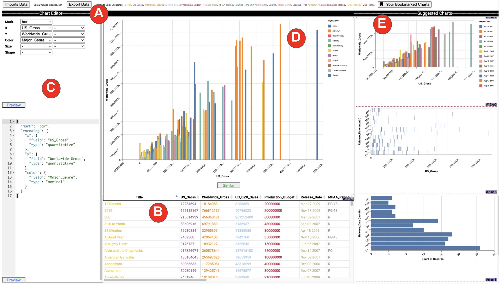

  <h1>ShiftScope: Adapting Visualization Recommendations to Users' Dynamic Data Focus</h1>
  

    <strong>SIGMOD 2024</strong> • Published in April 2024
  

  
  
  ## Abstract
  
  Visualization Recommendation Systems help users discover important insights during data exploration. These systems should understand users' exploration behaviors and goals to suggest relevant visualizations. However, users' mental models constantly evolve as they learn more about their data or as their personal or organizational goals change, leading to shifts in their data focus. Current systems do not adapt to these changes; therefore, they may inevitably suggest irrelevant visualizations over time. 
  
  Thus, we introduce ShiftScope, an interactive system that recommends personalized visualizations while adapting to users' conceptualization of data.
  ShiftScope utilizes a dual-agent reinforcement learning framework, where one agent adapts to evolution in data focus and collaborates with the other agent to recommend the best visualizations to satisfy users' current and future exploration needs.

    <a href="http://nischal5123.github.io/files/SIGMOD_Shiftscope.pdf" target="_blank" class="btn-enhanced btn-primary">
        📥 Download Paper
    </a>
    <a href="https://www.youtube.com/watch?v=n-jST9ShrfU" target="_blank" class="btn-enhanced btn-secondary">
        ▶ Watch Demo
    </a>

