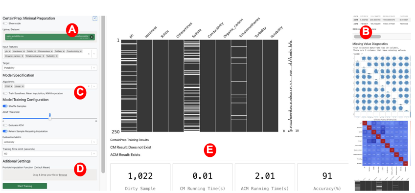

---
YouTube Video: https://www.youtube.com/watch?v=n-jST9ShrfU
CertainPrep takes training data and iden-
tifies missing values, inconsistent data, and outliers. The system
then evaluates the need for imputation by first checking the ex-
istence of CM. If a CM exists, CertainPrep provides a guaranteed
accurate CM without any imputation. If CM does not exist, our
system examines the existence of ACM based on the user’s input
for model accuracy requirements. When an ACM exists, users also
benefit from an accurate ML model with zero imputation.

    <a href="http://nischal5123.github.io/files/CertainPrep.pdf" target="_blank" 
       style="display: inline-block; padding: 12px 20px; font-size: 16px; font-weight: bold; 
              color: #fff; background-color: #0073e6; text-decoration: none; 
              border-radius: 8px; box-shadow: 2px 2px 8px rgba(0, 0, 0, 0.2);">
        📥 Download Paper
    </a>

