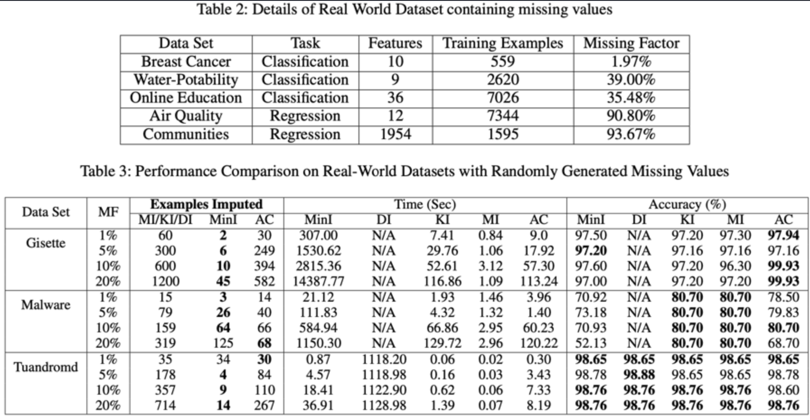

---

Missing data often exists in real-world datasets, requiring sig- nificant time and effort for imputation to learn accurate ma- chine learning (ML) models. In this paper, we demonstrate that imputing all missing values is not always necessary to achieve an accurate ML model. We introduce the concept of minimal data imputation, which ensures accurate ML models trained over the imputed dataset. Implementing minimal im- putation guarantees both minimal imputation effort and opti- mal ML models. We propose algorithms to find exact and ap- proximate minimal imputation for various ML models. Our extensive experiments indicate that our proposed algorithms significantly reduce the time and effort required for data im- putation.