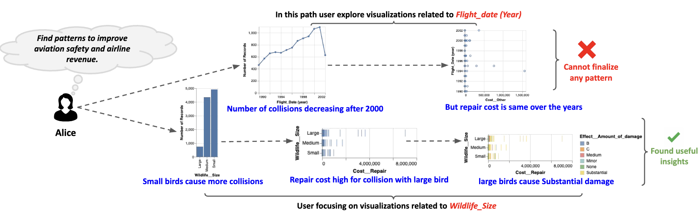

---

Exploratory visual analysis (EVA) is an essential stage of the data science pipeline, where users often lack clear analysis goals at the
start and iteratively refine them as they learn more about their data. Accurate models of users’ exploration behavior are becoming
increasingly vital to developing responsive and personalized tools for EVA. Yet we observe a discrepancy between the static view of
human exploration behavior adopted by many computational models versus the dynamic nature of EVA. This paper explores potential
parallels between the evolution of users’ interactions with visualization tools during data exploration and assumptions made in popular
online learning techniques. Through a series of empirical analyses using existing experiment data, we seek to answer the question:
What are the best learning methods for modeling shifts in users’ data focus during EVA? We present our findings and discuss their
implications for the future of user modeling for visualization system design.

    <a href="http://nischal5123.github.io/files/IUI25-Data-Focus.pdf" target="_blank" 
       style="display: inline-block; padding: 12px 20px; font-size: 16px; font-weight: bold; 
              color: #fff; background-color: #0073e6; text-decoration: none; 
              border-radius: 8px; box-shadow: 2px 2px 8px rgba(0, 0, 0, 0.2);">
        📥 Download Paper
    </a>

