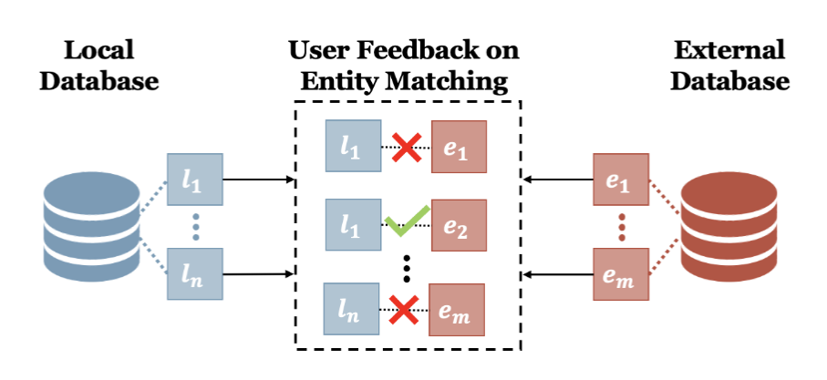

---
This project proposes a deep learning-based approach
that simulates the user-feedback loop in entity matching
and relevance modeling without the need for costly and
time-consuming data collection. Our method formulates
the relevancy modeling problem as a text/entity matching
task and leverages NLP techniques to learn matching pat-
terns from logged interactions. We evaluate our approach
on datasets from three popular domains and show its ef-
fectiveness, achieving close human performance. Further-
more, our approach demonstrates robust performance on
complex negative samples, indicating its potential to benefit
any domain that relies on user feedback

